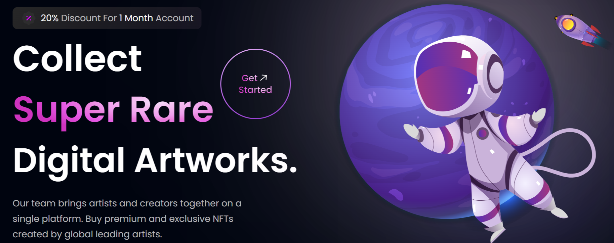

<h1 align=center>

</h1>

<div align="center">

 


</div>

# SandBox NFT Marketplace
## Index

- [About](#about)
- [Demo](#demo)
- [Built with](#technologies)
- [Preview](#preview)
- [Features](#features)
- [Run Locally](#local)
- [Feedback](#feedback)


<a id='about'/>

 ## :information_source: About

SandBox is the Modern  NFT Marketplace that allows you to the explore, create, sale, and purchase the digital arts and NFTs. <br/>
This project was bootstrapped using [vite](https://vitejs.dev/)


<a id='demo'/>

## :link: View Live

[Click to see live Demo](#https://sandbox-nft.netlify.app/)


<a id='technologies'/>

## :hammer: Built With

This project was developed with the following technologies:

#### **Frontend** <sub><sup>React</sup></sub>
  - [React](https://reactjs.org/)
  - [Tailwind CSS](https://tailwindcss.com/)


<a id='preview'/>

## :framed_picture: Preview

Check out how it looks:


<a id='features'/>

## :fire: Salient Features

- Use of Modern UX and UI
- Tuned Multiple complex Gradients
- soft and smooth animations
- Reusable react functional components
- Proper file and folder architecture 
- Fully Responsive along all devices 
- Cross platform

<a id='local'/>

## :computer: Run Locally

Clone the project

```bash
  git clone https://github.com/clair-daisies/sandbox-NFT-marketplace.git
```

Go to the project directory

```bash
  cd my-project
```

Install dependencies

```bash
  npm install
```

Start the server

```bash
  npm run dev
```

<a id='feedback'/>

## :love_letter: Feedback

If you have any feedback, please reach out to me at 


bootstrapped with vite
  

  React folder structure
  src>constants
  * index.js - All the static texts in the website
  
  src>style.js
  * Basic layout styles & text styles

  src>components
  All the resuable blocks of code

 src>components>index.js
 * it's gonna export all the components in single line for cleaner and readable code
